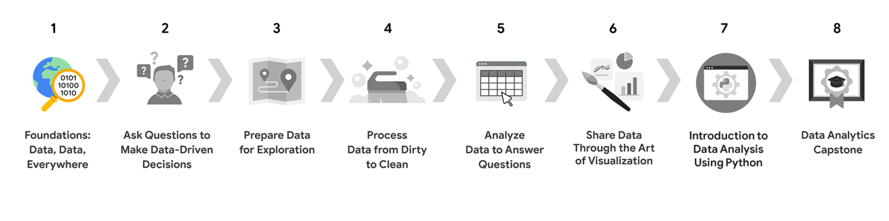

# 01 Foundations Data Everywhere

🧭 **Navegação Rápida**
- [🔙 Voltar para o Sumário Global](../README.md)
- [⏮️ Curso Anterior](../README.md)
- [⏭️ Próximo Curso](../02-Ask-Questions-to-Make-Data-Driven-Decisions/README.md)

📋 **Sumário do Curso**
- [Módulo 1: Introducing data analytics and analytical thinking](./Module-01/README.md)
- [Módulo 2: The wonderful world of data](./Module-02/README.md)
- [Módulo 3: Set up your toolbox](./Module-03/README.md)
- [Módulo 4: Become a fair and impactful data professional](./Module-04/README.md)
- [Laboratórios Práticos](./Labs/)
- [Glossário Oficial do Curso](./Data-Analytics-Certificate-glossary.docx)

---

## Introdução ao Curso

**Welcome to the Google Data Analytics Certificate**

Every day, the amount of data out there grows and grows. So the ability to interpret it effectively is more important than ever before. Data analytics is becoming one of the fastest-growing and most rewarding career choices in the world.

Currently, there are nearly 500,000 open jobs in data analytics, with a median entry-level salary of $92,000 and a 20% annual growth rate. Companies in all kinds of industries need qualified data analysts to solve problems and help make the best possible business decisions. And once you complete this program, you’ll be prepared to make smart, strategic, data-driven recommendations for organizations of all kinds.

Throughout the courses in this program, you’ll complete many assignments and projects based on both the practical activities and the day-to-day life of a data analyst. Along the way, you’ll learn how to ask the right questions and understand objectives. You’ll also discover how to effectively clean and organize large amounts of data to make it ready for high-quality analysis. On top of that, you’ll gain experience using all kinds of tools and techniques that will help you recognize patterns and uncover relationships between data points. Further, to help you communicate the results of your analysis, you’ll learn how to design visuals and dashboards. There’s even an opportunity to create a case study, which you can highlight in your resume to demonstrate what you have learned to potential employers.

## Visão Geral do Programa (Program Overview)

O programa consiste em oito cursos focados em análise de dados (mais um opcional sobre IA). **Foundations: Data, Data, Everywhere** é o primeiro curso desta jornada.

1. **Foundations: Data, Data, Everywhere (Este Curso)**
2. Ask Questions to Make Data-Driven Decisions
3. Prepare Data for Exploration
4. Process Data from Dirty to Clean
5. Analyze Data to Answer Questions
6. Share Data Through the Art of Visualization
7. Introduction to Data Analysis Using Python
8. Google Data Analytics Capstone: Complete a Case Study

## Conteúdo do Curso (Course 1 Content)

Este curso está dividido em módulos. Aqui está uma visão geral rápida das habilidades que você irá adquirir em cada um dos quatro módulos do Curso 1:

### [Módulo 1: Introducing data analytics and analytical thinking](./Module-01/README.md)
Data helps us make decisions in both everyday life and in business. In this part of the course, you’ll learn how data analysts use a variety of tools and skills to inform those decisions. You’ll also get to know more about this course and the overall program expectations.

### [Módulo 2: The wonderful world of data](./Module-02/README.md)
In this part of the course, you'll learn about the data life cycle and data analysis process. They are both relevant to your work in this program and on the job. You’ll also be introduced to applications that help guide data through the data analysis process.

### [Módulo 3: Set up your toolbox](./Module-03/README.md)
Spreadsheets, query languages, and data visualization tools are all a big part of a data analyst’s job. In this part of the course, you’ll learn the basic concepts to use them for data analysis. You’ll also understand how they work through interesting examples.

### [Módulo 4: Become a fair and impactful data professional](./Module-04/README.md)
In this part of the course, you’ll examine different types of businesses and the jobs and tasks that analysts do for them. You’ll also learn how a Google Data Analytics Certificate will help you meet many of the requirements for an analyst position with these organizations.

## O Que Esperar (What to Expect)

Cada módulo inclui uma série de lições com muitos tipos de oportunidades de aprendizado:
- **Vídeos** para os instrutores ensinarem novos conceitos e demonstrarem o uso de ferramentas.
- **Questões em vídeo** para checar seu entendimento de conceitos e habilidades chave.
- **Guias passo-a-passo** para acompanhar os instrutores na demonstração de ferramentas.
- **Leituras** para explorar tópicos com mais profundidade.
- **Quizzes práticos e avaliativos** para medir seu progresso.

## Conhecimentos e Habilidades em Análise de Dados
*(Autoavaliação de prontidão)*

Você avaliará seu conhecimento do processo de análise de dados considerando afirmações como:
- "Tenho um entendimento profundo sobre tomada de decisão baseada em dados e como isso guia a estratégia de negócios."
- "Sei selecionar e desenhar visualizações que me ajudam a comunicar insights efetivamente."
- "Consigo escrever um comando SQL que selecionaria várias colunas de uma tabela."
- "Sei limpar dados garantindo que não contêm duplicatas e estão no formato correto."

*(Se você já domina essas áreas, pode estar pronto para programas mais avançados como o Google Advanced Data Analytics ou Google Business Intelligence Certificate).*

[⬆ Voltar ao topo](#01-foundations-data-everywhere)
