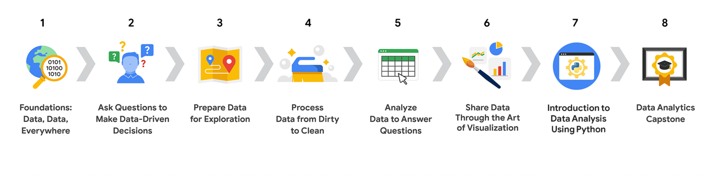

# Google Data Analytics Professional Certificate

  
  
  

Bem-vindo ao repositório de documentação do **Google Data Analytics Professional Certificate**. Este repositório tem como objetivo documentar de forma profunda, didática e técnica o meu progresso através do programa.

  
   
  

📋 **Sumário Global**

Abaixo encontra-se a lista de todos os cursos que compõem esta certificação. Clique em qualquer um dos links para acessar os materiais, anotações teóricas e laboratórios práticos.

1. [Foundations: Data, Data, Everywhere](./01-Foundations-Data-Everywhere/README.md)
2. [Ask Questions to Make Data-Driven Decisions](./02-Ask-Questions-to-Make-Data-Driven-Decisions/README.md)
3. [Prepare Data for Exploration](./03-Prepare-Data-for-Exploration/README.md)
4. [Process Data from Dirty to Clean](./04-Process-Data-from-Dirty-to-Clean/README.md)
5. [Analyze Data to Answer Questions](./05-Analyze-Data-to-Answer-Questions/README.md)
6. [Share Data Through the Art of Visualization](./06-Share-Data-Through-the-Art-of-Visualization/README.md)
7. [Introduction to Data Analysis Using Python](./07-Introduction-to-Data-Analysis-Using-Python/README.md)
8. [Google Data Analytics Capstone](./08-Google-Data-Analytics-Capstone/README.md)

---
*Repositório focado em conceitos de análise de dados, estatística e arquitetura técnica.*